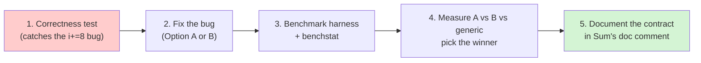

# NEXT_STEPS.md

Companion to `docs/WHY_IS_THIS_FAST.md`.

That document explains *why* the code is shaped the way it is. This document
records what I actually **verified**, what I **did not**, and what needs to be
built before "optimized" is a fact rather than a claim.

---

## 1. What I verified

```sh
go vet ./... && go build ./...
# -> BUILD_OK
```

The package compiles cleanly under `go1.26.5 darwin/arm64` with no vet findings.
That is the only thing currently proven.

## 2. What I found: a correctness bug in `sum_arm64.go`

The ARM64 main loop is:

```go
for i < limit {              // limit := n - 3
    s0 += xs[i] + xs[i+1]    // touches xs[i],   xs[i+1]
    s1 += xs[i+2] + xs[i+3]  // touches xs[i+2], xs[i+3]
    i += 8                   // <-- advances by 8, but only 4 numbers consumed
}
```

It consumes **4** elements per iteration but advances `i` by **8**, so it skips
half of the array (and the tail loop then picks up from the wrong place).

For `n = 12`, `limit = 9`:

| iteration | `i` | reads | `i` after |
|---|---|---|---|
| 1 | 0 | `xs[0..3]` | 8 |
| 2 | 8 | `xs[8..11]` | 16 |

`xs[4..7]` are never read. **The result is wrong.**

`sum_amd64.go` does not have this bug — it reads `xs[i]`…`xs[i+7]` and advances
by 8 consistently.

### Repro / verification (not yet in the repo)

There are currently **no tests at all** (`**/*_test.go` matched nothing), so this
bug is invisible to `go test`. The minimal check:

```sh
# once a test file exists
go test ./vec/ -run TestSumMatchesGeneric -v
```

I could not run a real repro without adding test files, which I've deliberately
left to you so you can decide on the shape of the suite. The manual inspection
above is unambiguous though — the loop bound and the stride disagree.

### The fix (choose one)

**Option A — minimal:** keep 2 accumulators, advance by 4.

```go
limit := n - 3
for i < limit {
    s0 += xs[i] + xs[i+1]
    s1 += xs[i+2] + xs[i+3]
    i += 4
}
```

**Option B — match x86-64:** 4 accumulators, advance by 8.

```go
limit := n - 7
for i < limit {
    s0 += xs[i] + xs[i+1]
    s1 += xs[i+2] + xs[i+3]
    s2 += xs[i+4] + xs[i+5]
    s3 += xs[i+6] + xs[i+7]
    i += 8
}
// ...
return (s0 + s1) + (s2 + s3)
```

Pick based on measurement, not taste — which is the point of the next section.

## 3. What's missing: benchmarks

The README claims "high-throughput" and "designed around ... register
saturation." Right now **nothing measures that**. Without numbers, "most
optimized" is a hypothesis.

Suggested first harness, `vec/bench_test.go`:

```go
func BenchmarkSum(b *testing.B) {
    for _, n := range []int{8, 1e3, 1e5, 1e7} {
        xs := make([]float64, n)
        for i := range xs {
            xs[i] = float64(i%17) * 0.5
        }
        b.Run(fmt.Sprint(n), func(b *testing.B) {
            b.SetBytes(int64(8 * n))
            var sink float64
            for i := 0; i < b.N; i++ {
                sink = Sum(xs)
            }
            _ = sink
        })
    }
}
```

Run with:

```sh
go test ./vec/ -bench=BenchmarkSum -benchmem -count=10
```

Notes that matter for honest numbers:

* Use `-count=10`; single runs on a laptop are noise.
* Report **GB/s**, not ns/op, so you can compare against memory bandwidth and
  see whether you're compute- or bandwidth-bound. `b.SetBytes` gives you this.
* Include a small `n` (like 8). The tuned version should **lose** there. If it
  doesn't, something is off.
* Use benchstat (`go install golang.org/x/perf/cmd/benchstat@latest`) before
  concluding anything.

## 4. What's missing: a correctness test

The bar is: the tuned path must agree with the plain loop to within accumulated
rounding error, **for every length**, especially the awkward ones around the
loop boundaries (`n = 0,1,2,3,4,7,8,9,11,12,15,16,17`).

```go
func TestSumMatchesGeneric(t *testing.T) {
    rng := rand.New(rand.NewSource(1))
    for n := 0; n <= 64; n++ {
        xs := make([]float64, n)
        for i := range xs {
            xs[i] = rng.NormFloat64()
        }
        want, got := naiveSum(xs), Sum(xs)
        // relative tolerance: reassociation changes the last bits legitimately
        tol := 1e-12 * math.Max(1, math.Abs(want))
        if math.Abs(want-got) > tol {
            t.Fatalf("n=%d: want %v, got %v", n, want, got)
        }
    }
}
```

The boundary lengths are the whole point — that's where the `n - 3` / `n - 7`
arithmetic and the tail loop get exercised.

## 5. What's missing: a cross-check against big.Float

Because the tuned version **reassociates** (see Part 11.4 of the explainer),
there is no single "correct" float64 answer. The meaningful reference is the
*exact* sum in higher precision:

```go
func exactSum(xs []float64) *big.Float {
    acc := new(big.Float).SetPrec(200)
    for _, v := range xs {
        acc.Add(acc, big.NewFloat(v))
    }
    return acc
}
```

Then assert the float64 result is within a few ULPs of the exactly-rounded
result. This catches *stability regressions*, which is the actual claim the
README makes ("prevent catastrophic cancellation") — and it's a claim that the
naive test in §4 cannot check.

## 6. What's missing: documentation of the contract

Two things the public API should state, once you've decided them:

1. **Is `Sum` order-independent?** `(s0+s1)+(s2+s3)` and
   `((s0+s1)+s2)+s3` differ in the last bits. Whatever you choose, say it.
2. **Does `Sum` guarantee bit-identical results across architectures?** Right
   now it does not, and cannot — different `GOARCH` runs different loop shapes.
   If you need reproducibility (e.g. for a trading audit trail), that's a design
   constraint you have to design *for*, not bolt on later.

## 7. Suggested order of work



Do them in that order. Step 1 before step 2, because a fix without a test is
just a new unverified claim. Step 4 before step 5, because you can't document a
decision you haven't measured.
