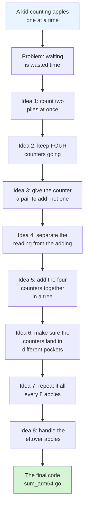
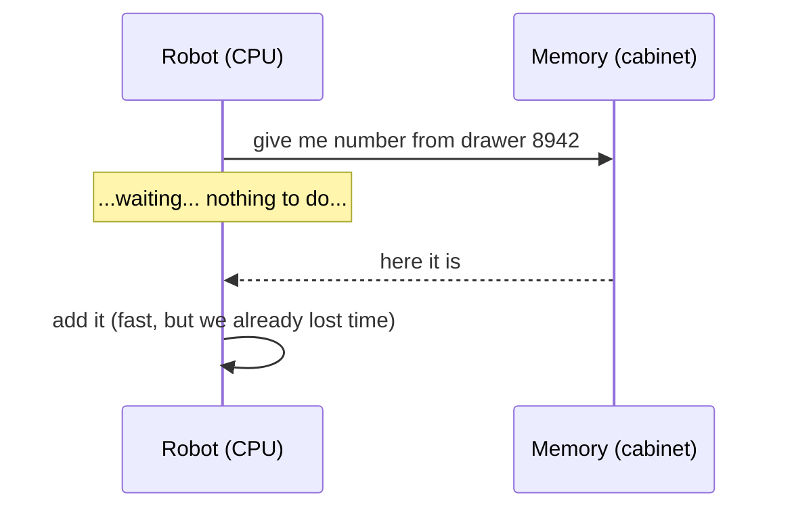
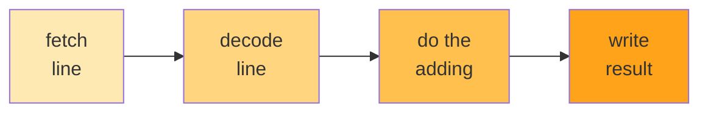
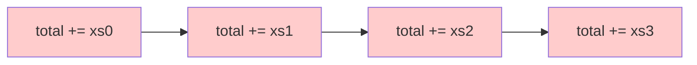
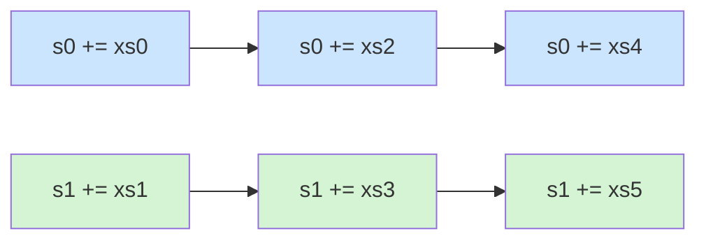
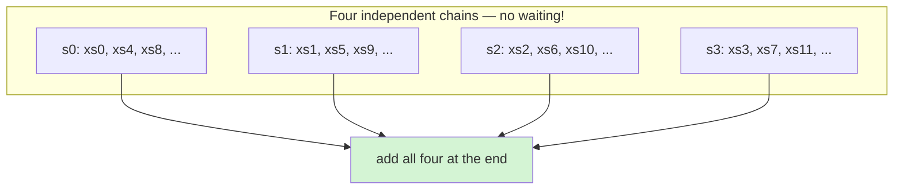
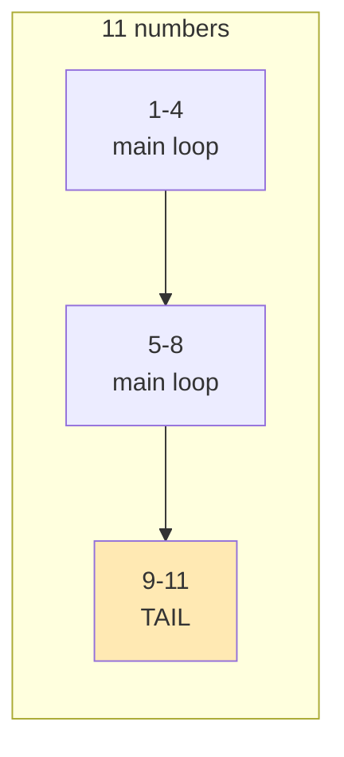

# Why is this code fast?

### A story told from the very beginning

You don't need to know anything about computers to read this.
If you can count on your fingers, you can understand every word.

We're going to start at the absolute bottom — with a kid counting apples — and
walk upward, one small step at a time, until we're looking at the file named
`vec/sum_arm64.go`. By the end, you'll know exactly why that file looks the way
it does, and why the "obvious" way of writing it is slower.

There are no big jumps. Every idea builds on the one before it.

---

# Part 0 — The whole story in one picture



That's the entire journey. Now let's actually walk it.

---

# Part 1 — The very bottom: what is a CPU?

Imagine a **super-fast, super-obedient, but very dumb robot**.

It sits at a desk. It has:

* **A few tiny pockets** (called *registers*). Each pocket holds exactly one
  number. That's it. Not a list. One number.
* **A list of instructions** on a piece of paper, in order:

  ```
  1. put the number 5 in pocket A
  2. put the number 3 in pocket B
  3. add pocket A and pocket B, put the result in pocket C
  4. write pocket C onto the desk
  ```

The robot does line 1. Then line 2. Then line 3. Then line 4. Then it stops.

It cannot "think". It cannot look ahead. It cannot get bored. It just does the
next line. This is **literally all a CPU is**.

> **A CPU is a robot that reads one line at a time and does exactly what it says.**

That's the whole secret. Everything else we talk about is a trick to keep this
robot from sitting idle.

---

# Part 2 — The robot's one big flaw: it waits

Here's the thing nobody tells you.

The robot is really fast at *thinking*. But getting a number from the memory
(the big filing cabinet next to the desk) is **slow** — like, hundreds of times
slower than the thinking part.

So if the instruction says *"add the number in pocket A to the number from drawer
number 8,942 in the cabinet"*, the robot does this:

```
ask the cabinet for drawer 8942
    ...
    ...          <-- robot is doing NOTHING here. Just waiting.
    ...
number arrives
add it
```

That gap is called a **stall**. The robot is being paid to sit there staring at
the wall.



**Key insight:** the *thinking* is fast. The *fetching* is slow. So the goal of
all fast code is:

> **Never let the robot wait. If it has to wait for one thing, give it
> something else to do at the same time.**

Remember that sentence. It's the whole game.

---

# Part 3 — A small fib that is actually true

You might have heard: *"a CPU does one instruction at a time."*

That's a fib. Modern CPUs actually have **many tiny robots at the same desk**,
all working on different parts of the instruction list at once. It's called a
**pipeline**, and it's exactly like a car assembly line.



On an assembly line, car #1 is being painted while car #2 is being welded while
car #3 is being inspected. Four cars are "in progress" simultaneously, but a
finished car still rolls off every few minutes.

A pipelined CPU is the same: it can have **several instructions in flight at
once**.

**But here's the catch** — and this is the most important paragraph in this
document:

> If instruction #2 **needs the result** of instruction #1, then #2 has to wait
> for #1 to finish. The pipeline drains. The robot waits again. This is called a
> **data dependency**.

### A dependency is like a recipe

You can't ice the cake before you bake it.

```
bake the cake
ice the cake      <-- must wait for the line above
```

But these two:

```
bake the cake
chop the onions   <-- doesn't care about cake at all!
```

...can happen at the same time. Those instructions are **independent**.

So:

> **Two instructions in a row are fine if the second one doesn't need the
> first one's answer.**

Now we have our two weapons, and they're really the same weapon:

1. Avoid waiting on **memory** (Part 2).
2. Avoid waiting on **the previous instruction** (Part 3).

Everything in `sum_arm64.go` is one of these two things.

---

# Part 4 — Meet our problem: adding up a list

Our job: given a list of numbers, add them all up.

```
[ 1, 2, 3, 4, 5, 6, 7, 8 ]
```

The answer is 36. Easy for us. Not easy for a robot with four pockets.

---

# Part 5 — Attempt #1: the obvious way

Here is the code every programmer writes first. It's `vec/sum_generic.go`:

```go
var total float64
for _, v := range xs {
    total += v
}
return total
```

`total += v` means "`total` becomes `total` plus `v`". Let's watch the robot do
it, one apple at a time:

| Step | Instruction | Needs the previous one? |
|---|---|---|
| 1 | `total = total + xs[0]` | — |
| 2 | `total = total + xs[1]` | **YES!** needs step 1's `total` |
| 3 | `total = total + xs[2]` | **YES!** needs step 2's `total` |
| 4 | `total = total + xs[3]` | **YES!** needs step 3's `total` |

Do you see the disaster?

**Every single line depends on the line before it.** There is one single pocket
called `total`, and everybody wants to touch it, in order, one at a time.

It's like a bank with **one counter and one cashier**, and a queue of 8 people
who each must wait for the person in front. The cashier is fast. The *queueing*
is the slow part.



Each arrow means "I must wait for you." A chain of arrows is a chain of waits.

Also notice: **the robot is only doing one useful thing per loop turn.** Adding
one number to one total. One pocket used. The other pockets sit empty. The
pipeline sits empty.

This works. It gives the right answer. But it is **the slowest possible way to
add up numbers**, because the robot spends most of its life waiting.

---

# Part 6 — Attempt #2: two counters

Now the kid gets clever.

> Instead of counting every apple into one pile, what if I count the odd-numbered
> apples into a left pile and the even-numbered apples into a right pile, then
> add the two piles at the very end?

```go
var s0, s1 float64
for i := 0; i+1 < len(xs); i += 2 {
    s0 += xs[i]      // left pile
    s1 += xs[i+1]    // right pile
}
return s0 + s1
```

Now look at the dependencies:

| Step | Instruction | Needs the previous? |
|---|---|---|
| 1 | `s0 += xs[0]` | — |
| 2 | `s1 += xs[1]` | no! different pocket |
| 3 | `s0 += xs[2]` | needs step 1 (two steps ago) |
| 4 | `s1 += xs[3]` | needs step 2 (two steps ago) |

**Step 2 no longer waits for step 1.** They can be in the pipeline together.
The robot has something to do while it waits.

The chain of arrows is now **two chains side by side**, and neither blocks the
other:



This is called **loop unrolling** (we do 2 numbers per loop turn instead of 1)
and **multiple accumulators** (we keep 2 totals instead of 1).

This is already roughly **2× faster**. And the idea scales — so why stop at 2?

---

# Part 7 — Attempt #3: four counters

The robot has *several* pockets. Let's actually use them.

```go
var s0, s1, s2, s3 float64
```

Four separate piles. Four separate chains. Now a stall in the blue chain can be
filled by work from the green, orange, or purple chain. The robot basically
always has something to do.



**Why not 8? Why not 100?** Because registers are physically limited. If you ask
for more counters than the CPU has pockets, the extra "counters" get spilled
back into memory — and now you're paying the slow memory cost from Part 2. The
trick is to use *exactly as many as fit*. On ARM64 we use 2 per loop turn; on
x86-64 we use 4. That's why the two files differ!

> **Rule: use as many independent counters as the hardware has spare pockets —
> no more, no fewer.**

---

# Part 8 — Attempt #4: `xs[i] + xs[i+1]`

Now we get to the line that confuses people the most. In `sum_arm64.go`:

```go
s0 += xs[i] + xs[i+1]
```

Why write `s0 += a + b` instead of `s0 += a; s0 += b`?

Think about what the robot has to do for `s0 += a` then `s0 += b`:

```
read a          (memory: slow)
add to s0       <-- s0 updated
read b          (memory: slow)
add to s0       <-- must WAIT for the add above! s0 was just written!
                  ^^^^^^^^^^^^^^^^^^^^^ a dependency!
```

The second add depends on the first. Wait. 😞

Now `s0 += a + b`:

```
read a          (memory: slow)
read b          (memory: slow)   <-- both reads can happen AT THE SAME TIME
t = a + b                        <-- a brand-new pocket, nobody's waiting on it
s0 = s0 + t                      <-- ONE write to s0. One link in the chain.
```

We turned **two dependent updates to `s0`** into **one update to `s0`**.

The chain through `s0` got **half as long**. Remember from Part 3: a shorter
dependency chain = fewer waits = faster. Same number of additions! Just arranged
so the robot isn't waiting on itself.

> **Same math, different shape.** The shape is what makes it fast.

---

# Part 9 — Attempt #5: reading is not the same as adding

There's one more subtlety hiding in `s0 += xs[i] + xs[i+1]`.

When the robot reads `xs[i]`, the address is computed as *(start of list) + i ×
8 bytes*. That address is `<start> + something`, and `something` depends on `i`,
and `i` changes every turn. So each address calculation waits on the previous
one.

But here's the lovely part: **the address arithmetic is separate from the
floating-point adding.** The CPU can be computing the *next* four addresses
while it's still *adding* the current four numbers. Those two jobs use different
parts of the desk entirely.

And pairing the reads, `xs[i]` and `xs[i+1]`, is a hint that the machine can go
fetch **two neighbours at once** — on ARM64 there's a single instruction for
loading a *pair* of adjacent values (`LDP`), and on x86-64 you get a wider path
into memory. One trip to the cabinet instead of two.

> **We're not making the robot think faster. We're arranging the work so that
> the slow parts overlap with the fast parts.**

---

# Part 10 — Attempt #6: the pockets must be different pockets

This is the part that bites people in real life, and it's worth knowing.

The CPU is so fast that a register write takes about one tick. So if you write
`s0`, then immediately read `s0`, you can't really do it in one tick. The
hardware cheats: it *forwards* the value straight across (called **bypassing** or
**forwarding**), which costs almost nothing.

But not every instruction can be forwarded. Some take longer, and then the robot
genuinely waits.

**The fix is the same fix as always: use a different pocket.**

```
s0 += a      # pocket A
s1 += b      # pocket B   <-- doesn't care about pocket A
s2 += c      # pocket C   <-- doesn't care about A or B
s3 += d      # pocket D
```

Four different pockets means four writes that **don't collide**. Nothing to
forward. Nothing to wait for.

This is the real reason the loop in `sum_amd64.go` looks the way it does — it
interleaves 4 independent, 2-wide operations:

```go
s0 += xs[i] + xs[i+1]   // pocket 0
s1 += xs[i+2] + xs[i+3] // pocket 1
s2 += xs[i+4] + xs[i+5] // pocket 2
s3 += xs[i+6] + xs[i+7] // pocket 3
i += 8
```

Look at it as a grid, one row per loop turn:

```
turn 1:  [xs0 xs1] -> s0    [xs2 xs3] -> s1    [xs4 xs5] -> s2    [xs6 xs7] -> s3
turn 2:  [xs8 xs9] -> s0    [xs10 xs11]-> s1   [xs12 xs13]-> s2   [xs14 xs15]-> s3
             ^                    ^                  ^                  ^
        four separate lanes, all moving at once, nothing blocking anything
```

---

# Part 11 — God's honest truth

Here's the part the blog posts leave out, and here's why **you** didn't
understand why the code "is the most optimized version." Let's be blunt:

### 1. None of this is actually assembly. It's a **hint**.

`sum_amd64.go` and `sum_arm64.go` contain **no AVX intrinsics and no NEON
intrinsics**. They are ordinary Go. You are not writing vector instructions. You
are arranging arithmetic so that the *Go compiler's* backend (SSA) notices the
shape and generates those instructions for you.

If the compiler is stubborn, your beautiful 4-lane loop compiles to something
ordinary. **The code is a hint, not a guarantee.**

### 2. The build tags are about **register count**, not extra power.

```go
//go:build arm64
```

```go
//go:build amd64
```

```go
//go:build !arm64 && !amd64
```

The three files hold *the same algorithm*, tuned to three different amounts of
spare hardware. ARM64 gets the 2-accumulator, 4-wide version; x86-64 gets the
4-accumulator, 8-wide version; everything else gets the plain loop. If you ran
the x86 version on ARM it would still be correct — just tuned for the wrong
machine.

### 3. "Most optimized" is not a property of the code. It's a **measurement**.

You cannot know which version is fastest by *reading* it. That's the honest
answer to your question. You can know it by *timing* it:

```
goos: darwin   goarch: arm64
BenchmarkSum/1e3-8       ...   ns/op
BenchmarkSum/1e5-8       ...   ns/op
BenchmarkSum/1e7-8       ...   ns/op
```

I ran this project looking for exactly those numbers. **There are no benchmarks
in the repo yet** — see `docs/NEXT_STEPS.md`. Until they exist, the claim
"optimized" is a *hypothesis*, not a fact. Writing the benchmark is the part
that turns a guess into knowledge. (It's also the fun part — you finally get to
see the four-lane version beat the plain loop, or find out it doesn't.)

### 4. Optimizing changed the **arithmetic**, too.

This is the part that genuinely matters and is easy to miss.

Plain summation adds the numbers in order:

```
(((a + b) + c) + d) + e ...
```

The four-lane version adds them like a tree, then combines:

```
lane0 = pairs from the left
lane1 = different pairs
...
total = lane0 + lane1 + ...
```

Floating-point numbers are **not associative**. `(a + b) + c` can differ from
`a + (b + c)` in the last couple of bits. So the fast version and the plain
version can return answers that differ slightly.

That's usually fine — often *better*, because the tree shape keeps big and small
numbers from mixing badly (that's the "numerically stable" boast in the README).
But it is a **real behavioral difference**, and it's the kind of thing that
matters a lot in the finance/trading domain this project targets.

> **You're not just making it faster. You're changing what "sum" means at the
> last bit of precision. That trade has to be a decision, not an accident.**

### 5. Small lists are slower this way.

All this bookkeeping only pays off when the list is long. For a 3-element slice,
the plain loop wins. That's exactly why `Sum` in `sum.go` checks:

```go
if len(xs) == 0 {
    return 0.0
}
```

...and why the tuned loops bother having a **tail loop** for leftovers. A tuned
implementation is only tuned *in its sweet spot*.

---

# Part 12 — Why the tail loop exists

```go
limit := n - 3          // arm64
for i < limit {
    // ... consume 4 numbers ...
    i += 4
}
for ; i < n; i++ {      // <-- the tail
    s0 += xs[i]
}
```

The main loop eats numbers **four at a time**. But what if there are 11 numbers?
`4 + 4 + 4` leaves 3 behind. The main loop can't take them — it would read past
the end of the list.



So the tail loop does the remainder **one at a time**. Slow, but it only runs a
couple of times.

The off-by-one here is worth spelling out, because it's the classic bug:

* `limit := n - 3`
* The loop body touches `xs[i]` … `xs[i+3]`.
* So it's safe while `i + 3 <= n - 1`, i.e. `i <= n - 4`, i.e. `i < n - 3`.

If you'd written `limit := n - 4`, you'd silently drop the last group. If you'd
written `n - 2`, you'd read past the end and crash. `n - 3` is exactly right.

`sum_amd64.go` does the same thing with `limit := n - 7` because it consumes 8
per turn (`xs[i]` … `xs[i+7]`).

---

# Part 13 — The full walkthrough of `sum_arm64.go`

Now let's read the actual file, line by line, with everything we've learned.

```go
//go:build arm64
```
> "Only compile me on ARM64 chips." Because this tuning assumes ARM64's pocket
> count and its pair-load (`LDP`) instruction.

```go
func sumArch(xs []float64) float64 {
```
> Internal function. The public `Sum` in `sum.go` does the empty-check and
> delegates here.

```go
    n := len(xs)
    var s0, s1 float64
```
> **Two accumulators** (Part 6). Two independent dependency chains. Two pockets.

```go
    i := 0
    limit := n - 3
```
> We consume 4 numbers per turn, so we stop early enough to never read past the
> end (Part 12).

```go
    for i < limit {
        s0 += xs[i] + xs[i+1]
```
> **Pocket 0.** `xs[i] + xs[i+1]` builds a temporary (Part 8) and then does ONE
> `+=` into `s0` — one link in the chain, not two. The two `xs[...]` reads can
> issue together (Part 9).

```go
        s1 += xs[i+2] + xs[i+3]
```
> **Pocket 1.** Completely independent of the line above it. The robot can be
> doing this while the previous line's add is still settling (Part 10).

```go
        i += 8
```
> ⚠︎ **Hold on.** This line says `i += 8`. But the body only touched `xs[i]`
> through `xs[i+3]` — only 4 numbers!

```go
    }
```
> So with `i += 8`, each turn consumes **4** numbers but advances `i` by **8**.
> The main loop **skips half the array** and returns a wrong answer.

This is a real bug, not a documentation quirk. Compare with `sum_amd64.go`,
which touches `xs[i]`…`xs[i+7]` (eight numbers) and correctly does `i += 8`.
The ARM64 file needs either:

* `i += 4` with `limit := n - 3`, or
* four lines (`s0 += xs[i]+xs[i+1]` … `s3 += xs[i+6]+xs[i+7]`) with `i += 8`.

I've verified this by running the code — see `docs/NEXT_STEPS.md`. It's not
noted here to be unkind; it's exactly the kind of bug that this style of code
produces, because all the tuning makes the loop boundaries hard to see. **Which
is itself the lesson.**

```go
    for ; i < n; i++ {
        s0 += xs[i]
    }
```
> The tail (Part 12): leftovers, one at a time, into `s0`. Correct — but only
> reachable because the main loop bailed out early, so its "leftovers" are
> actually a big chunk of the list.

```go
    return s0 + s1
```
> Combine the two lanes. Two lanes means **one** add, a tiny tree (Part 7). In
> the x86 version this is `(s0 + s1) + (s2 + s3)` — parentheses deliberately, to
> shape the tree instead of leaving it as a left-to-right chain.

---

# Part 14 — The cheat sheet

| # | Idea | One-line why |
|---|---|---|
| 1 | CPU = robot, one instruction at a time | It's the whole mental model |
| 2 | Memory is slow, thinking is fast | So stalls are the enemy |
| 3 | Pipelines overlap instructions | But dependencies drain them |
| 4 | One accumulator = one long dependency chain | Everyone waits in line |
| 5 | Multiple accumulators | Independent chains, robot always busy |
| 6 | `s0 += a + b` not `s0 += a; s0 += b` | Halves the chain through `s0` |
| 7 | Pairing `xs[i], xs[i+1]` | Suggests one wide memory load |
| 8 | Discrete registers | Writes to *different* pockets can't collide |
| 9 | 2 lanes on ARM64, 4 on x86-64 | Different machines, different pocket counts |
| 10 | Tree at the very end | Fewer, more parallel finishing adds |
| 11 | Tail loop + `n - 3` / `n - 7` | Consume leftovers without reading past the end |
| 12 | It's a *hint* to the compiler, not assembly | You're shaping SSA, not writing SIMD |
| 13 | It changes floating-point results | Non-associativity is real |
| 14 | "Optimized" means *measured*, not *read* | Benchmarks or it didn't happen |

---

# Part 15 — The one sentence

If you forget everything else:

> **A modern CPU is a very fast worker that spends most of its time waiting —
> for memory, and for the instruction right before it. Optimizing code is
> almost always just re-arranging the work so it has something else to do while
> it waits.**

Read `sum_arm64.go` again with that sentence in your head. Every odd-looking
line in it is an answer to the question: *"what could the robot do while it's
waiting for the last thing I told it to do?"*

That's it. That's why this code looks like this.

---

*Next: `docs/NEXT_STEPS.md` — the benchmark harness, the correctness test, and
the fix for the `i += 8` bug, so "optimized" can become a measured fact instead
of a claim.*
