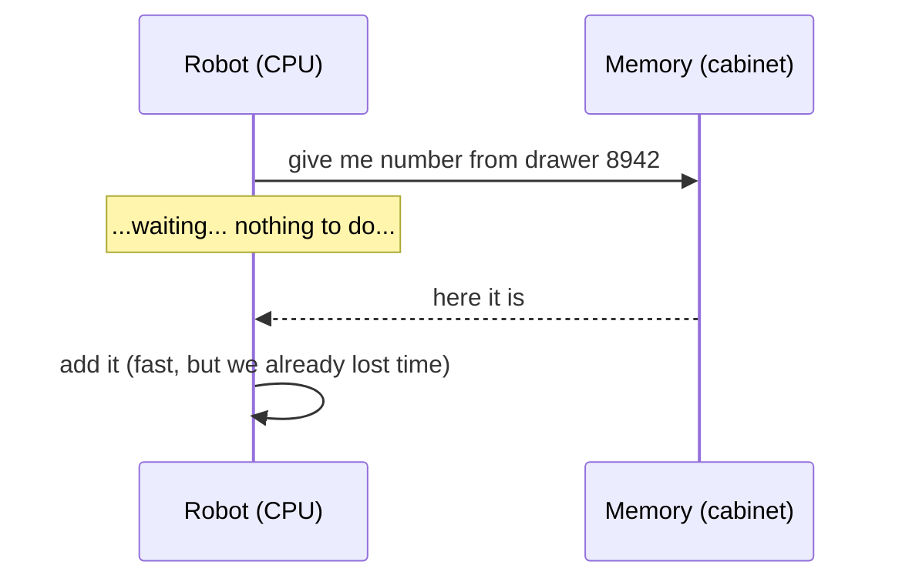
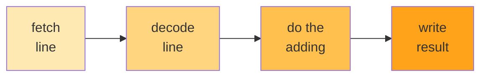

# Part 01 — Fundamentals

> **Prerequisites:** none. If you can count on your fingers, you can read this.

This part builds the mental model from nothing: a robot at a desk, and the two
reasons it spends most of its time doing nothing.

By the end you will understand the one sentence that explains every optimized
loop in this package.

---

## 1. The very bottom: what is a CPU?

Imagine a **super-fast, super-obedient, but very dumb robot**.

It sits at a desk. It has:

* **A few tiny pockets** (called *registers*). Each pocket holds exactly one
  number. That's it. Not a list. One number.
* **A list of instructions** on a piece of paper, in order:

  ```
  1. put the number 5 in pocket A
  2. put the number 3 in pocket B
  3. add pocket A and pocket B, put the result in pocket C
  4. write pocket C onto the desk
  ```

The robot does line 1. Then line 2. Then line 3. Then line 4. Then it stops.

It cannot "think". It cannot look ahead. It cannot get bored. It just does the
next line. This is **literally all a CPU is**.

> **A CPU is a robot that reads one line at a time and does exactly what it says.**

That's the whole secret. Everything else is a trick to keep this robot from
sitting idle.

---

## 2. The robot's one big flaw: it waits

Here's the thing nobody tells you.

The robot is really fast at *thinking*. But getting a number from memory (the big
filing cabinet next to the desk) is **slow** — hundreds of times slower than the
thinking part.

So if an instruction says *"add the number in pocket A to the number from drawer
8,942 in the cabinet"*, the robot does this:

```
ask the cabinet for drawer 8942
    ...
    ...          <-- robot is doing NOTHING here. Just waiting.
    ...
number arrives
add it
```

That gap is called a **stall**. The robot is being paid to sit there staring at
the wall.



**Key insight:** the *thinking* is fast. The *fetching* is slow.

> **Never let the robot wait. If it has to wait for one thing, give it something
> else to do at the same time.**

Remember that sentence. It's the whole game.

---

## 3. A small fib that is actually true

You might have heard: *"a CPU does one instruction at a time."*

That's a fib. Modern CPUs actually have **many tiny robots at the same desk**,
all working on different parts of the instruction list at once. It's called a
**pipeline**, and it's exactly like a car assembly line.



On an assembly line, car #1 is being painted while car #2 is being welded while
car #3 is being inspected. Several cars are "in progress" simultaneously, but a
finished car still rolls off every few minutes.

A pipelined CPU is the same: it can have **several instructions in flight at
once**.

**But here's the catch** — and this is the most important paragraph in this
document:

> If instruction #2 **needs the result** of instruction #1, then #2 has to wait
> for #1 to finish. The pipeline drains. The robot waits again. This is called a
> **data dependency**.

### A dependency is like a recipe

You can't ice the cake before you bake it.

```
bake the cake
ice the cake      <-- must wait for the line above
```

But these two:

```
bake the cake
chop the onions   <-- doesn't care about cake at all!
```

...can happen at the same time. Those instructions are **independent**.

So:

> **Two instructions in a row are fine if the second one doesn't need the
> first one's answer.**

Now we have our two weapons, and they're really the same weapon:

1. Avoid waiting on **memory** (section 2).
2. Avoid waiting on **the previous instruction** (section 3).

Everything in the tuned loops of `vec/arch_arm64.go` and `vec/arch_amd64.go` is one of
these two things.

---

## 4. Two kinds of loop, and why it matters

This distinction will matter enormously in Part 03, so it's worth planting now.

**A reduction** walks a slice and produces one number:

```go
var total float64
for _, v := range xs {
    total += v      // every iteration needs the last iteration's total
}
```

This loop **waits on itself**. Each add needs the previous add's result, so the
pipeline drains once per element. This is the worst case, and it's what most of
this package is about.

**An elementwise map** walks two slices and writes a third:

```go
for i := range dst {
    dst[i] = xs[i] + ys[i]    // needs nothing from the previous iteration
}
```

This loop **never waits on itself**. Every output depends only on its own
inputs. The compiler was already free to overlap everything, and there was never
a stall to eliminate.

> **Same syntax. Completely different problem.** Tuning a reduction recovers
> stalled cycles; tuning a map recovers nothing, because nothing was stalled.

That's why the same tricks in this package buy ~4× on `Sum` and only ~1.3× on
`Add`. The measurements are in [../benchmarks.md](../benchmarks.md).

---

## 5. The one sentence

If you forget everything else:

> **A modern CPU is a very fast worker that spends most of its time waiting —
> for memory, and for the instruction right before it. Optimizing code is almost
> always just re-arranging the work so it has something else to do while it
> waits.**

Hold onto that. In the next part we'll watch eight attempts at the same trivial
problem, each one just a different answer to the question: *"what could the robot
do while it's waiting for the last thing I told it to do?"*

---

**Next:** [02-the-buildup.md](02-the-buildup.md) — eight attempts at summing a
list, each fixing the previous one's flaw.
