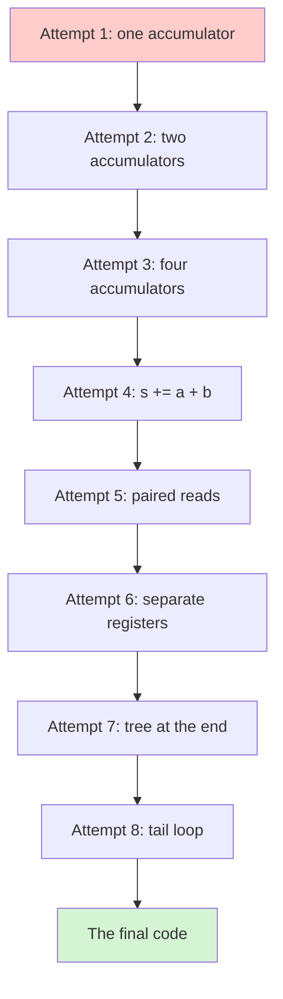
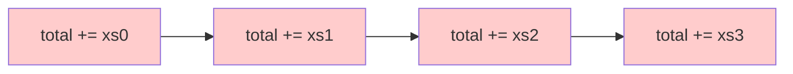
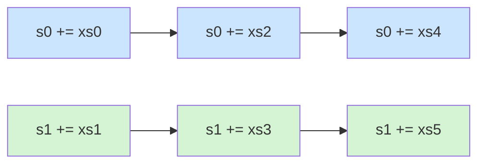
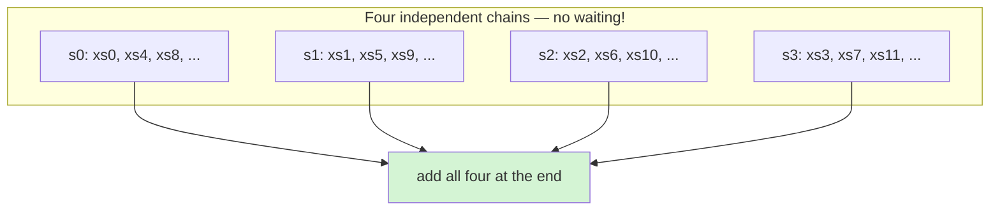
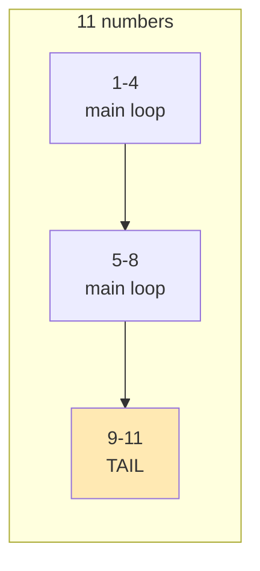

# Part 02 — The Build-Up

> **Prerequisites:** [01-fundamentals.md](01-fundamentals.md). This part assumes
> you know what a dependency chain is and why it's the enemy.

Eight attempts at the same trivial problem — summing a list of numbers. Each one
fixes the specific flaw in the one before it. No attempt is wasted; every one is
still visible in the final code.



---

## Attempt 1 — The obvious way

The code every programmer writes first. This is `vec/arch_generic.go`, and the same
loop appears as `naiveSum` in `bench_test.go`, where it is the baseline every
tuned version is measured against.

```go
var total float64
for _, v := range xs {
    total += v
}
return total
```

`total += v` means "`total` becomes `total` plus `v`". Let's watch the robot do
it, one element at a time:

| step | instruction | needs the previous one? |
|---|---|---|
| 1 | `total = total + xs[0]` | — |
| 2 | `total = total + xs[1]` | **YES!** needs step 1's `total` |
| 3 | `total = total + xs[2]` | **YES!** needs step 2's `total` |
| 4 | `total = total + xs[3]` | **YES!** needs step 3's `total` |

Do you see the disaster?

**Every single line depends on the line before it.** There is one single pocket
called `total`, and everybody wants to touch it, in order, one at a time.

It's like a bank with **one counter and one cashier**, and a queue of eight
people who each must wait for the person in front. The cashier is fast. The
*queueing* is the slow part.



Each arrow means "I must wait for you." A chain of arrows is a chain of waits.

Also notice: **the robot only does one useful thing per loop turn.** One pocket
used. The other pockets sit empty. The pipeline sits empty.

This works. It gives the right answer. But it is the slowest possible way to add
up numbers, because the robot spends most of its life waiting.

---

## Attempt 2 — Two counters

Now the kid gets clever.

> Instead of counting every apple into one pile, what if I count the odd-numbered
> apples into a left pile and the even-numbered apples into a right pile, then add
> the two piles at the very end?

```go
var s0, s1 float64
for i := 0; i+1 < len(xs); i += 2 {
    s0 += xs[i]      // left pile
    s1 += xs[i+1]    // right pile
}
return s0 + s1
```

Now look at the dependencies:

| step | instruction | needs the previous? |
|---|---|---|
| 1 | `s0 += xs[0]` | — |
| 2 | `s1 += xs[1]` | no! different pocket |
| 3 | `s0 += xs[2]` | needs step 1 (two steps ago) |
| 4 | `s1 += xs[3]` | needs step 2 (two steps ago) |

**Step 2 no longer waits for step 1.** They can be in the pipeline together. The
robot has something to do while it waits.

The chain of arrows is now **two chains side by side**, and neither blocks the
other:



This is called **loop unrolling** (we do two numbers per loop turn instead of
one) and **multiple accumulators** (we keep two totals instead of one).

Already roughly **2× faster**. And the idea scales — so why stop at two?

---

## Attempt 3 — More counters

The robot has *several* pockets. Let's actually use them.

```go
var s0, s1, s2, s3 float64
```

Four separate piles. Four separate chains. A stall in the blue chain can be
filled by work from the green, orange, or purple chain. The robot essentially
always has something to do.



**Why not 8? Why not 100?** Because registers are physically limited. If you ask
for more accumulators than the CPU has pockets, the extra ones get spilled back
into memory — and now you're paying the slow memory cost from
[01-fundamentals.md](01-fundamentals.md) section 2. The trick is to use *exactly
as many as fit*.

This is why ARM64 uses 2 accumulators and x86-64 uses 4. Different machines,
different numbers of spare pockets.

> **Rule: use as many independent accumulators as the hardware has spare
> registers — no more, no fewer.**

---

## Attempt 4 — `s0 += xs[i] + xs[i+1]`

Now the line that confuses people the most:

```go
s0 += xs[i] + xs[i+1]
```

Why write `s0 += a + b` instead of `s0 += a; s0 += b`?

Think about what the robot has to do for `s0 += a` then `s0 += b`:

```
read a          (memory: slow)
add to s0       <-- s0 updated
read b          (memory: slow)
add to s0       <-- must WAIT for the add above! s0 was just written!
                  ^^^^^^^^^^^^^^^^^^^^^ a dependency!
```

The second add depends on the first. Wait. 😞

Now `s0 += a + b`:

```
read a          (memory: slow)
read b          (memory: slow)   <-- both reads can happen AT THE SAME TIME
t = a + b                        <-- a brand-new register, nobody's waiting on it
s0 = s0 + t                      <-- ONE write to s0. One link in the chain.
```

We turned **two dependent updates to `s0`** into **one update to `s0`**.

The chain through `s0` got **half as long**. Same number of additions! Just
arranged so the robot isn't waiting on itself.

> **Same math, different shape.** The shape is what makes it fast.

---

## Attempt 5 — Reading is not the same as adding

When the robot reads `xs[i]`, the address is computed as *(start of list) + i × 8
bytes*. That address is `<start> + something`, and `something` depends on `i`,
and `i` changes every turn. So each address calculation waits on the previous one.

But here's the lovely part: **the address arithmetic is separate from the
floating-point adding.** The CPU can be computing the *next* four addresses while
it's still *adding* the current four numbers. Those two jobs use different parts
of the desk entirely.

And pairing the reads, `xs[i]` and `xs[i+1]`, suggests the machine can fetch **two
neighbours at once** — on ARM64 there is a single instruction for loading a *pair*
of adjacent values (`LDP`), and on x86-64 you get a wider path into memory. One
trip to the cabinet instead of two.

> **We're not making the robot think faster. We're arranging the work so that the
> slow parts overlap with the fast parts.**

---

## Attempt 6 — Different pockets

This is the part that bites people in real life.

The CPU is so fast that a register write takes about one tick. So if you write
`s0`, then immediately read `s0`, you can't really do it in one tick. The hardware
cheats: it *forwards* the value straight across (called **bypassing** or
**forwarding**), which costs almost nothing.

But not every instruction can be forwarded. Some take longer, and then the robot
genuinely waits.

**The fix is the same fix as always: use a different pocket.**

```
s0 += a      # pocket A
s1 += b      # pocket B   <-- doesn't care about pocket A
s2 += c      # pocket C   <-- doesn't care about A or B
s3 += d      # pocket D
```

Four different pockets means four writes that **don't collide**. Nothing to
forward. Nothing to wait for.

This is the real reason the x86-64 loop in `vec/arch_amd64.go` looks the way it does:

```go
s0 += xs[i] + xs[i+1]   // pocket 0
s1 += xs[i+2] + xs[i+3] // pocket 1
s2 += xs[i+4] + xs[i+5] // pocket 2
s3 += xs[i+6] + xs[i+7] // pocket 3
i += 8
```

Look at it as a grid, one row per loop turn:

```
turn 1:  [xs0 xs1] -> s0    [xs2 xs3] -> s1    [xs4 xs5] -> s2    [xs6 xs7] -> s3
turn 2:  [xs8 xs9] -> s0    [xs10 xs11]-> s1   [xs12 xs13]-> s2   [xs14 xs15]-> s3
             ^                    ^                  ^                  ^
        four separate lanes, all moving at once, nothing blocking anything
```

---

## Attempt 7 — The tree at the end

Once the main loop finishes you have several partial sums, and you have to combine
them. *How* you combine them matters.

A left-to-right fold:

```
((s0 + s1) + s2) + s3
```

A balanced tree:

```go
return (s0 + s1) + (s2 + s3)
```

The parentheses are deliberate. The tree is:

* **Shorter.** One level deep instead of three, so fewer dependent adds at the end.
* **More accurate.** It pairs similar-magnitude partial sums together. Each
  partial sum has been accumulating a similar portion of the input, so adding them
  in pairs keeps large and small magnitudes from being repeatedly mixed. That's
  part of what the README means by "numerically stable".

Over a long input this is a trivial cost. But it's free, so there's no reason not
to.

---

## Attempt 8 — The tail loop

The main loop eats numbers in fixed-size groups. But what if the length isn't a
multiple of the group size?

```go
limit := n - 3          // arm64
for i < limit {
    // ... consume 4 numbers ...
    i += 4
}
for ; i < n; i++ {      // <-- the tail
    s0 += xs[i]
}
```

If there are 11 numbers, `4 + 4 + 4` leaves 3 behind. The main loop can't take
them — it would read past the end of the slice.



So the tail loop does the remainder **one at a time**. Slow, but it runs at most
three times.

The off-by-one is worth spelling out, because it's the classic bug:

* `limit := n - 3`
* The loop body touches `xs[i]` … `xs[i+3]`.
* So it's safe while `i + 3 <= n - 1`, i.e. `i <= n - 4`, i.e. `i < n - 3`.

If you'd written `limit := n - 4`, you'd silently drop the last group. If you'd
written `n - 2`, you'd read past the end. `n - 3` is exactly right.

The x86-64 loop does the same thing with `limit := n - 7` because it consumes 8
per turn (`xs[i]` … `xs[i+7]`).

---

## The finished code, line by line

Now let's read the actual ARM64 summation (`sumArch` in `vec/arch_arm64.go`) with
everything we've learned.

```go
//go:build arm64
```
> "Only compile me on ARM64 chips." Because this tuning assumes ARM64's register
> count. `vec/arch_amd64.go` has the same functions tuned for x86-64, and
> `vec/arch_generic.go` has plain versions for everything else.

```go
func sumArch(xs []float64) float64 {
```
> Internal function. The public `Sum` in `vec/sum.go` does the empty-check and
> delegates here. This split exists so the tuned loops can assume a non-empty
> input and skip the branch on every call.

```go
    n := len(xs)
    var s0, s1 float64
```
> **Two accumulators** (Attempt 2). Two independent dependency chains. Two
> pockets.

```go
    i := 0
    limit := n - 3
```
> We consume 4 numbers per turn, so we stop early enough to never read past the
> end (Attempt 8).

```go
    for i < limit {
        s0 += xs[i] + xs[i+1]
```
> **Pocket 0.** `xs[i] + xs[i+1]` builds a temporary (Attempt 4) and then does ONE
> `+=` into `s0` — one link in the chain, not two. The two `xs[...]` reads can
> issue together (Attempt 5).

```go
        s1 += xs[i+2] + xs[i+3]
```
> **Pocket 1.** Completely independent of the line above it. The robot can be
> doing this while the previous line's add is still settling (Attempt 6).

```go
        i += 4
```
> ⚠︎ **Hold on.** The body only read `xs[i]` through `xs[i+3]` — four numbers. So
> four is correct. But [03-the-truth.md](03-the-truth.md) has a story about a
> version of this code that said `i += 8`, and what the disassembly revealed about
> it. It's worth reading before you trust your eyes on code like this.

```go
    }
```
> End of the main loop. Four elements per turn, increment by four. Consistent.

```go
    for ; i < n; i++ {
        s0 += xs[i]
    }
```
> The tail (Attempt 8): leftovers, one at a time, into `s0`. At most three
> elements, because the main loop stops at `n - 3`.

```go
    return s0 + s1
```
> Combine the two lanes with a tree (Attempt 7). Two lanes means just one add
> here. In the x86-64 version it's `(s0 + s1) + (s2 + s3)`.

---

## The pattern, generalized

Every reduction in this package has that same shape. Once you can read one, you
can read all of them.

```go
func someReduction(xs []float64) float64 {
    n := len(xs)

    // K independent partial results. K matches the machine's register budget:
    // 2 on ARM64, 4 on x86-64.
    var acc0, acc1 float64

    i := 0
    limit := n - 3                    // stop early: body reads 4, so n-3 is safe

    for i < limit {
        acc0 += f(xs[i]) + f(xs[i+1])  // two independent chains, two each
        acc1 += f(xs[i+2]) + f(xs[i+3])
        i += 4
    }

    for ; i < n; i++ {                 // tail: at most 3 elements
        acc0 += f(xs[i])
    }

    return acc0 + acc1                 // small tree, not a long chain
}
```

Change `f` and you get a different reduction:

| `f(v)` | operation |
|---|---|
| `v` | `Sum` |
| `v*v` | `SumSq` |

With a second slice, `acc0 += f(xs[i], ys[i])` gives `Dot`. The *shape* of the
loop is what makes it fast. Which operation you're computing is almost
incidental.

### Where the pattern doesn't apply

Two families of operation deliberately break the pattern, and knowing why is more
instructive than the pattern itself.

**`Min` / `Max` — no pairwise trick exists.** You can write `acc += a + b` to
shorten an addition chain, because addition combines two elements into one before
touching the accumulator. There is no `min` equivalent: no way to pre-combine
`xs[i]` and `xs[i+1]` into one value that then compares against the accumulator in
a single link. So a scan keeps the full-length dependency chain and only gains
from splitting the input into independent partial scans:

```go
v0, v1 := xs[i], xs[i+1]
if v0 < m0 { m0 = v0 }    // chain 1
if v1 < m1 { m1 = v1 }    // chain 2, independent
```

That's why min/max runs at roughly 3–5 GB/s while `Sum` reaches 25 GB/s on the
same data. It's not a worse implementation; it's a *latency-bound* problem rather
than a *throughput-bound* one, and no amount of loop restructuring changes that.

**`Add` / `Sub` / `Mul` / `Scale` — no chain to break in the first place.**
`dst[i] = xs[i] + ys[i]` has no loop-carried dependency at all. Every output
depends only on its own inputs, so the compiler was already free to overlap
everything, and there was never a stall to eliminate. Tuning these gains only
~1.3×, because the loop was never the bottleneck — memory bandwidth was.

> **The lesson: "optimize the loop" is not a universal instruction.** You have to
> know what the loop is *waiting on* first. Reductions wait on themselves. Scans
> wait on themselves even harder. Elementwise maps don't wait at all.

---

**Next:** [03-the-truth.md](03-the-truth.md) — what is actually compiling, what
the measurements say, and the mistake this documentation originally made.
