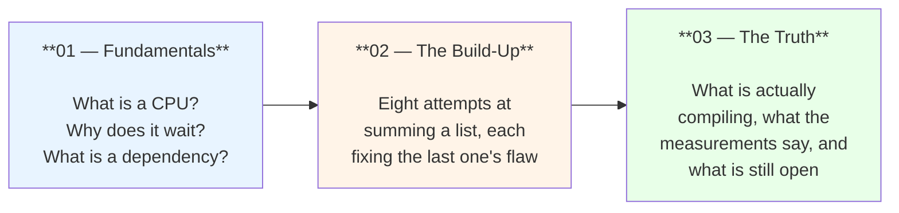

# Why is this code fast?

### A story told from the very beginning

You don't need to know anything about computers to read this.
If you can count on your fingers, you can understand every word.

This is a three-part tutorial. Each part stands on the one before it, so read
them in order.

---

## Part 01 — Fundamentals

**[01-fundamentals.md](01-fundamentals.md)**

Starts at absolute zero: a robot at a desk with a few tiny pockets, reading one
instruction at a time. Covers the two things that make code slow — waiting on
memory, and waiting on the previous instruction — and why a modern CPU can
overlap work but cannot overlap *dependent* work.

Ends with the one sentence that explains the whole codebase.

**Read this if:** you want to understand why any optimized code looks weird, not
just this package.

## Part 02 — The Build-Up

**[02-the-buildup.md](02-the-buildup.md)**

Eight attempts at the same trivial problem — summing a list — each one fixing the
specific flaw in the previous attempt:

| attempt | idea | gains because |
|---|---|---|
| 1 | one accumulator | *baseline* |
| 2 | two accumulators | two independent chains |
| 3 | four accumulators | more independent chains |
| 4 | `s += a + b` | halves the chain length |
| 5 | paired reads | one wide memory access |
| 6 | four lanes on x86-64 | different machines, different register counts |
| 7 | tree at the end | fewer, more parallel finishing adds |
| 8 | tail loop | handles leftovers without overrunning |

Then a line-by-line walkthrough of the finished ARM64 summation, including the
disassembly.

**Read this if:** you want to follow one idea from "naive" to "optimized" without
any leaps.

## Part 03 — The Truth

**[03-the-truth.md](03-the-truth.md)**

The parts the tutorials usually leave out:

* The code is a **hint** to the compiler, not assembly. There are no intrinsics.
* The **binary is the truth, not the source** — including a mistake this
  documentation originally made by trusting the source over the disassembly.
* The measured numbers, and what they reveal that reading could not.
* The three kinds of loop (reduction, scan, elementwise map) and why the same
  tuning gives ~4x, ~1x, and ~1.3x respectively.
* The costs: reassociation changes results, and tuned code is *slower* on short
  slices.

**Read this if:** you have ever wondered "yes, but is it *actually* faster?" and
wanted an answer you can check.

---

## Where to go next

| document | purpose |
|---|---|
| **[../design.md](../design.md)** | Reference: the architecture-dispatch pattern, how to add an operation, invariants to preserve |
| **[../benchmarks.md](../benchmarks.md)** | The raw measurements, reproduction commands, and caveats |
| **[../next-steps.md](../next-steps.md)** | What is verified, what is still open, what needs deciding |
| **[../../README.md](../../README.md)** | The API surface |
