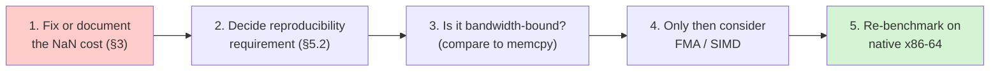

# Next Steps

Companion to [learn/](learn/), [design.md](design.md) and
[benchmarks.md](benchmarks.md).

The tutorial explains the reasoning. The design doc covers the structure. The
benchmark file records the numbers. This file records what is verified, what is
open, and what should be done next.

---

## 1. A correction

An earlier revision of this documentation claimed a correctness bug in the ARM64
summation: that `i += 8` advanced past two of the four elements the loop body
read, silently skipping half the input.

**That claim was wrong.** It came from reading the source and reasoning about what
it "should" do, without checking what actually executes. The disassembly settles
it: the compiler emits `ADD $4, R3, R3`, because the extra `+4` is dead arithmetic
(nothing reads `xs[i+4]`) and is folded away.

The full story, with the disassembly and the lesson, is in
[learn/03-the-truth.md](learn/03-the-truth.md) section 3. The short version:

> **The source code is a hint. The compiled binary is the truth.** Verify by
> disassembling or by measuring — never by inspection.

`TestSumKnownValues` in `vec/sum_test.go` now pins the exact result at lengths 1
through 100, so this specific concern cannot silently regress.

## 2. What is verified

| check | command | status |
|---|---|---|
| arm64 tests | `go test ./vec/` | **pass** |
| amd64 tests (Rosetta 2) | `GOARCH=amd64 go test ./vec/` | **pass** |
| arm64 vet | `go vet .` | **pass** |
| amd64 vet | `GOARCH=amd64 go vet .` | **pass** |
| generic vet (386, riscv64, js/wasm) | `GOOS/GOARCH=… go vet .` | **pass** |
| formatting | `gofmt -l .` | **clean** |
| benchmarks | `go test ./vec/ -bench=. -benchmem` | **run** — see [benchmarks.md](benchmarks.md) |

Coverage, applied to every operation:

* all boundary lengths 0–17, plus 23–25, 31–33, 63–65, 127–129
* agreement with a reference implementation
* **per-element perturbation** (catches skipped or double-counted elements)
* hand-computed known values (catches errors hidden inside a relative tolerance)
* empty and nil inputs
* mismatched lengths
* `dst` aliasing `xs`, `ys`, and both simultaneously
* panic on length mismatch for every `*To` variant
* identity cross-checks: `SumSq(xs) == Dot(xs, xs)`, `Mean(xs) == Sum(xs)/n`
* accuracy against a 200-bit `big.Float` reference
* **NaN propagation at every position**, including index 0 and index n-1

## 3. Open decision (highest priority): the NaN check costs the entire scan speedup

This is the most action-needed item in the repo.

`Min`, `Max` and `MinMax` enforce the documented "NaN wins" policy by calling
`hasNaN`, which walks the input a second time. Measured at n=4M on arm64:

| | GB/s | vs naive |
|---|---|---|
| naive loop | 4.79 | 1.00× |
| `minArch` (tuned, no NaN check) | 9.49 | **1.98×** |
| `Min` (tuned + NaN check) | 4.67 | **0.98×** |

The tuning works. The second pass eats all of it. **The README currently advertises
tuned scans that measure the same as naive ones**, which needs either fixing or
documenting honestly.

Three options, in rough order of preference:

1. **Fold NaN detection into the scan loop.** Write the loop so NaN handling is
   part of the comparison rather than a separate pass. This is the right fix if it
   works, but the scan is latency-bound, so adding work to the loop is not free —
   it must be measured, not assumed. Note that the loop structure would likely
   change (the accumulator can no longer be seeded naively from `xs[0]`).
2. **Drop the check and document the weaker guarantee.** Restores 1.98×, but the
   behaviour becomes positional: a NaN at index 0 gets overwritten, a NaN at the
   end gets returned. That is worse than either explicit policy, so this is only
   acceptable if the documentation is very loud about it.
3. **Accept the cost.** Defensible on the grounds that correctness beats throughput
   and 4.7 GB/s is still fast. But then the README should stop implying the scans
   are tuned to be faster.

**Do not leave it undecided.** Right now the code and the documentation disagree
about what the scans deliver.

## 4. What is not verified

* **Native x86-64 throughput.** The amd64 figures were taken under Rosetta 2,
  which translates x86-64 to ARM64 rather than executing it natively. Correctness
  is genuinely verified there; absolute performance is not representative. Any
  decision resting on x86-64 magnitudes needs real hardware.
* **`GOAMD64`/`GOARM` variants.** `GOAMD64=v3` (AVX2) and above are untested. The
  tuning here is scalar-accumulator ILP rather than SIMD, so the variant should
  matter less than usual — a prediction, not a measurement.
* **Compensated summation.** No Kahan/Neumaier variant is offered.
* **Concurrency.** Nothing here is safe to call concurrently against a shared
  destination slice, and that is not documented outside the aliasing note.

## 5. Numerical properties to be aware of

Deliberate properties, not defects — but the kind that surprise people in
production:

1. **The reductions reassociate.** `Sum` may differ in the last bits from a plain
   `for` loop. `TestSumIsNotLessAccurateThanNaive` checks the tuned result is no
   *further* from the exact answer than the naïve one, which is a different
   property from agreeing with the naïve loop.

2. **No cross-architecture reproducibility.** arm64 and amd64 run different loop
   shapes and may return different last bits for identical input. If you need a
   reproducible audit trail, this package cannot provide one as currently designed.

3. **`(xs+ys)-ys != xs`, exactly.** The round trip is accurate only to within a
   relative epsilon. `TestAddSubRoundTrip` asserts the tolerance rather than
   equality, and documents why.

4. **`Min`/`Max` return `±Inf` on empty input**, making them usable as running
   identities — which also means an empty slice is not an error. Callers decide.

5. **`Min`/`Max`/`MinMax` return NaN if any input element is NaN.** This is now
   specified, implemented, and tested. See §3 for its performance cost.

## 6. Further open decisions

1. **Compensated summation.** Offer `SumKahan`/`SumNeumaier` for callers who need
   accuracy more than throughput. The test infrastructure already exists —
   `exactSum` in `vec/sum_test.go` is a 200-bit reference.

2. **Fused multiply-add.** `Dot` and `SumSq` currently compile to a separate
   multiply and add. With hardware FMA this could be one instruction with one
   rounding, which is both faster and *more accurate*. Worth measuring — but it
   changes results again, so it interacts with §5.2 and §6.3.

3. **Reproducible summation via assembly.** If cross-architecture
   bit-reproducibility is required, the only way to keep the tuned loops is for each
   architecture to emit *identical* arithmetic operations in an identical order,
   differing only in scheduling. That is a genuine design constraint and should be
   decided early if it matters.

4. **Two-pass algorithms.** `Mean` is one pass, but a variance/covariance
   implementation would naturally be two. **No amount of loop tuning fixes reading
   the input twice** — the fix is a one-pass algorithm (Welford's). Worth deciding
   before implementing variance.

5. **SIMD.** The current approach is scalar-accumulator ILP relying on the
   compiler's autovectorizer. Explicit NEON/AVX2 intrinsics would need CGo or
   assembly, breaking the zero-dependency pure-Go constraint in the README. A
   middle path is `GOAMD64=v3`-gated code, which preserves that constraint.
   Whether it is worth doing depends on §6.6.

6. **Is there headroom left?** [benchmarks.md](benchmarks.md) shows the tuned
   reductions plateauing at the machine's memory bandwidth. If they are truly
   bandwidth-bound, SIMD wins nothing: the bytes are already moving as fast as the
   memory controller allows. Settling this is a prerequisite for §6.5, not a
   follow-up to it.

## 7. Suggested order of work

§3 first, because the code and the documentation currently disagree. §5.2 second,
because it is a decision that gates what the arithmetic is even allowed to do.
§6.6 third, because it determines whether §6.5 is a conversation worth having: if
the loops are already at memory bandwidth, they are not.
